> I have decided to join the war on gooning, on the side of gooning.
                                                  - Albert Einstein

## Addiction Criteria

| # Criteria Satisfied | Substance Use Disorder severity |
| -------------------- | ------------------------------- |
| 2-3                  | mild                            |
| 4-5                  | moderate                        |
| 6-11                 | severe - signals an addiction   |
 - [ ] Using more of a substance than intended or using it for longer than you’re meant to. 
 - [ ] Trying to cut down or stop using the substance but being unable to.
 - [ ] Experiencing intense cravings or urges to use the substance.
 - [ ] Tolerance, needing more of the substance to get the desired effect .
 - [ ] Developing withdrawal symptoms when not using the substance.
 - [ ] Spending more time getting and using drugs and recovering from substance use.
 - [ ] Neglecting responsibilities at home, work or school because of substance use.
 - [ ] Continuing to use even when it causes relationship problems.
 - [ ] Giving up important or desirable social and recreational activities due to substance use.
 - [ ] Using substances in risky settings that put you in danger.
 - [ ] Continuing to use despite the substance causing problems to your physical and mental health. 
 
>[!IMPORTANT]
>The DSM5 is the golden standard on mental disorders therefore all studies in the video and my writing use this to define addiction assuming they are not garbage.

## Video Time
### [3:45](https://youtu.be/LzMi2VsKBIs?si=1Bn-b_pJ6oFf3dNl&t=225)
Asserts that social anxiety at 13 was primarily caused or severely amplified by jorkin.
Hopefully it's quite obvious why this is silly, at that age puberty starts which would be a much  simpler explanation. 
Also one would expect that the hormonal shift of that age would eclipse anything else especially something as hard to detect as the adverse effects of porn.

### [4:35](https://youtu.be/LzMi2VsKBIs?si=87NOXkFXJWjtqUch&t=275)
- The levels of anxiety described here are well outside the norm.
- "It amplified it to a very unnatural degree, way further than what would have been normal for things that naturally happen around this age".

The average age of self-reported first exposure to online pornography is 12 years old. Namely by age 13 54% of teenagers have viewed online pornography and by age 15 97% . [^1]  
If it were true that jorking had the potential to cause this level of anxiety to teenagers you would have seen an incredible spike in teenage suicidality and depression/anxiety since smartphones became common probably to the point of a national emergency, I have seen nothing of the sort. 
At the very least there would be some information from mental health care professionals towards parents on the risks of porn for teenagers and it would have been a common occurrence to do breathing exercises before hanging out with people XDD.

### [5:21](https://youtu.be/LzMi2VsKBIs?si=qjzdtjpuZEfU1LvP&t=321)
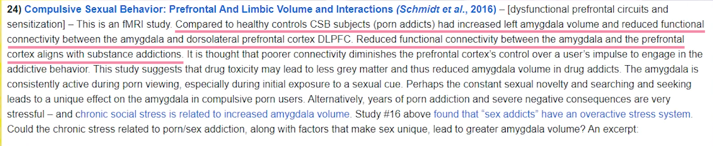
This raises two questions
1. How severe is this abnormality on porn addicts compared to other addicts and control groups.
2. Is there a causal relationship between SUD and brain abnormalities.

The first one I wont answer cause CBA learning all the jargon needed and going through all the studies I'd have to.

I got lucky with the second count and found a [2023 meta analysis](https://onlinelibrary.wiley.com/doi/abs/10.1111/acps.13539) that went through 106 studies on SUD which did indeed find abnormalities in the brains of SUD patients but was not able to establish a causal link! [^2]

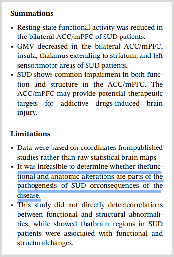
> [!NOTE]
> The study went through established SUD agents (eg alcohol heroin etc)  and not porn specifically but it would be hard to find something like that since porn addiction isnt recognized as an addiction from either DSM-5 DSM-5-TR or ICD-11

----
I want to take some time here to explore how stupid that singular cutoff is at 5:21. The conclusion the article is trying to make is not corroborated by the excerpt of the scientific article shown **AT ALL** 

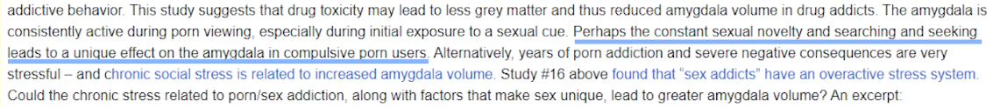
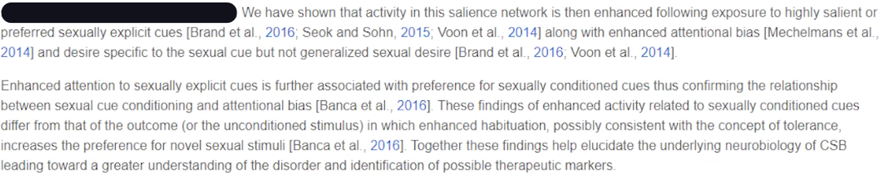
The highlighted part comes straight from the ass. The excerpt states that the abnormalities found in the brain would corroborate the findings of enhanced attention to sexually explicit cues and the enhanced habituation which results in seeking of novel  stimuli, which every self respecting coomer can attest to. 

The excerpt says **the brain change seems to cause the behavior** and this retard somehow read it as **the novelty seeking leads to bigger amygdala**. I'm speechless.

Continuing on with the stupidity

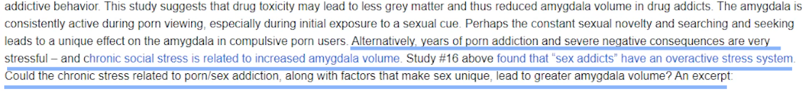
This part says that since chronic stress is related to increased amygdala volume and sex addicts have been found to have an overactive stress system porn addiction causes an increase in amygdala volume.

1. At no point is it proven that the sex addiction causes an overactive stress system. It can very well be that stress is a risk factor for addictions...
2. It is beyond me how one can assert that the stress is the cause of the increase in amygdala size and not the other way around without any citations.

Lastly that part on drugs is completely out of left field, at no point when discussing porn are drugs  brought up and I cant think of any obvious connection. 

That article reads and feels like a ChatGPT sourced thing that was rewritten by a human.

---

### [5:35](https://youtu.be/LzMi2VsKBIs?si=vwkVJz7AReNe5e1L&t=335)
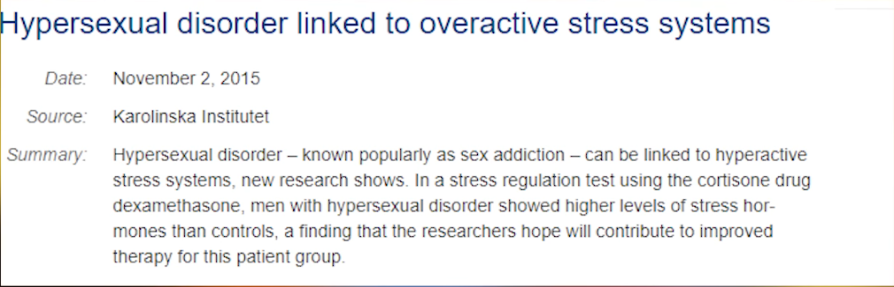
I managed to find the actual study!

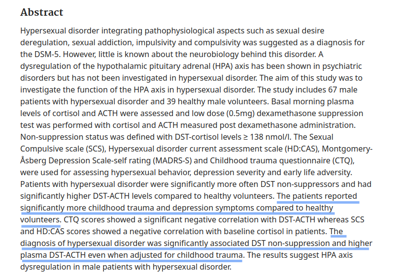
This does suggest to anyone that bothered to even read the **fucking abstract** (20 seconds) that DST non-suppression and higher plasma DST-ACTH was there since childhood and not caused by hypersexual disorder but rather is a strong risk factor for it.

### [5:44](https://youtu.be/LzMi2VsKBIs?si=Obuq-SMDcoDtyHQL&t=344)
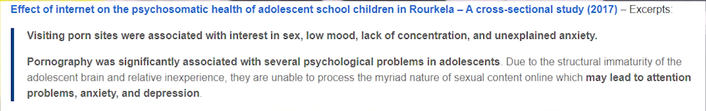
One would note that this is a cross section study, those studies are meant for finding associations between two things and **NOT** causal links. Especially one with 2 fucking citations LMAO. So the comment in the study about the structural maturity of the brain and how that interacts with online sexual content is way over reaching especially since that was purely statistics gathering from self reporting of students, there were no brain scans involved that could even point to the cause presented by the authors. 

Funnily enough a systematic review with 179 citations that sited this trash of a study lists the same factors as risk factors and **NOT** as being the symptoms of pornography among adolescents.[^3] [^4]
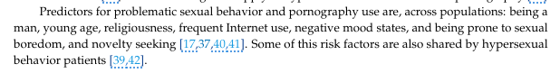
> [!NOTE]
If we used the same logic on this excerpt from the systematic review as the authors, we would find that problematic sexual behavior and pornography use can make you male.

---
To further demonstrate the absurdity of the authors line of thinking.

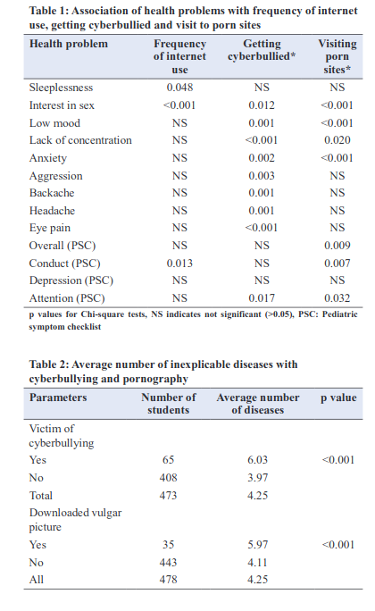

If we take that same line of thought with their other findings we will conclude that the mind of adolescents is in fact so underdeveloped that the simple saving of mommy milkers to their hard drive will cause them to contract diseases 52% more often than their non downloading mommy milkers counterparts. (self reported)

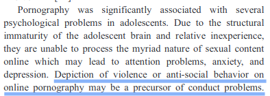

This can simply not be asserted. To my knowledge this has been disproven but even if I am wrong you cant just throw that shit in there for the fun of it.

---

### [6:02](https://youtu.be/LzMi2VsKBIs?si=mEn2Gc78IwTAs4Lf&t=362)
Not sure if I need to hammer this point more but **CORRELATED**.

### [6:08](https://youtu.be/LzMi2VsKBIs?si=UACAviQezLghHhei&t=368)
I cannot fathom how he thinks we have established causation BEYOND A SHADOW OF A DOUBT.

### [6:45](https://youtu.be/LzMi2VsKBIs?si=cD5A_SmNtAzaRMTx&t=405)
Funnily enough the timing for his severe anxiety stopping is about the time when puberty stops (starts at ages $11\frac{1}{2} - 12$ and ends at ages $16-17$ for boys).
Also i will point out again that porn use is very common among kids that age, if the cause was truly his porn use you would expect a huge increase in kids shacking from anxiety in their bed at night since the introduction of smartphones and so on. It would be a full fledged national emergency not some addiction that hasn't even been proven to exist separate from impulse-control disorder or even general sexual addiction.[^3] [^4]

#### [7:26](https://youtu.be/LzMi2VsKBIs?si=DKa_ATPO4jJlSPR-&t=446)
This uses the same study as before and it's just as silly as before. The idea that you have no concentration because you watch porn is silly. Especially silly since the mechanism asserted if you dont jork in the morning, the activities stated and the mention of ADHD lead me to think he is referring to the amount of dopamine released, wouldn't effect your dopamine levels during school. 

He then goes on a rant asserting that his low self control was because of jorking and how this affected him. I cba going through all of the points again just read above zzz.

#### [9:47](https://youtu.be/LzMi2VsKBIs?si=TpcMJJy8I1TfOo0O&t=587)
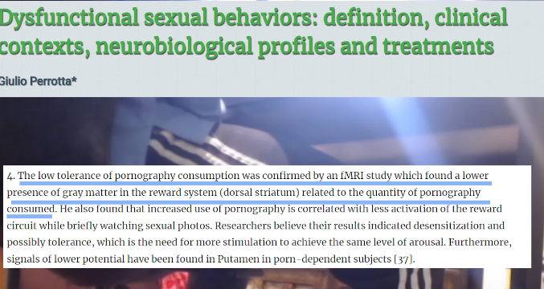
A person with low impulse control (such as one with a smaller dorsal striatum) engages in more high dopamine instant gratification behavior. Shocker.  But no we have to assert that the porn reduced their brain matter somehow.

It's worth stating that **ADHD is low impulse control at it's core**. Wonder which [Gerbert Johnson](https://www.youtube.com/@gerbertjohnson) would ever possibly have been diagnosed with ADHD as a kid and said so in a video.
> [!NOTE]
> I took him at his word that this study isn't trash because I cant find the will to go through every single study that he vomits out, especially since he doesn't link them (or read them I think). 
> But accounting for how bad the conclusions he has drawn from the previous citations and the quality of the cross-section study, I have a lot of reservations even though the excerpt does state what I found to be generally accepted in academia on the subject.

#### [9:57](https://youtu.be/LzMi2VsKBIs?si=OXmt5bETc9ps-WKp&t=597)
This is not how that works at all!
TLDR:  the short pathway is always highly preferred but the [frontal cortex can bias towards the longer pathway](https://youtu.be/wLE71i4JJiM?si=71YjU1zkGnfqdYA7&t=1451), the frontal cortex is [driven by dopamine](https://youtu.be/wLE71i4JJiM?si=xmHA1n_2HV1ZCH_a&t=3177).

Throwing the depression at the feet of gooning is silly, there is no reason why you would think it caused that, at least none presented. If this were true every psychologist would tell you to stop gooning when you went for therapy, like please make it stop. 

#### [10:47](https://youtu.be/LzMi2VsKBIs?si=CSQXeKMBY38OTTMD&t=647)
The dick skin hurting, nut on shirt and wasting a lot of time I can buy. Although I would be interested to see what you do with your time all day now that you don't goon, are you productive all hours of the day? How fucking long were you gooning for either way you weirdo.

#### [11:05](https://youtu.be/LzMi2VsKBIs?si=rPWtVcS5SqxzqROW&t=665)
This is a bit hard to address because he is talking about personal experience but I have a few points for it.

1. The guy watched porn during his puberty, where you are positively brimming with testosterone. It is really not uncommon to be perma horny, porn or no porn, although the imagery that he envisioned would have probably been different. This, in my opinion, invalidates his experience as a case study. I would have a completely different feeling about it if he started jorking it now and reported that he sees women differently or thinks about sex constantly.
2. My personal experience is the polar opposite. If I am horny you are all meat to me, and porn makes me not horny, in fact it makes me have no interest in women or sex. Every single time I have stopped watching porn for more than a week I start developing an interest to women around me irl where there was only apathy before. This does coincide with a common criticism I have seen levied against porn by psychologists namely that porn creates incels as it dampens the drive to pursue women and the qualities that would make you attractive to them. 
3. Lastly on account of the imagery and ideas one would gain from watching porn since a young age. I will also add onto this the extra factor of seeking novel and more extreme form of stimuli from porn over time. My personal experience with this is that it doesn't matter at all, I wouldn't want to do the things I watch in porn irl with a partner and so the point is moot. I will also add that this isn't strictly negative even if you do envision yourself doing what you see in porn, assuming that you can find a partner that would be into it, to the extent that you learn new fun things to try in your sexual life.

Also are we really supposed to take life advice from someone who's experience with a subject is restricted to their 13-17? In the same sense that you wouldn't take relationship advice from someone that had two relationships during those ages that is.

## Conclusions
He goes on to say some things I take issue with still, how all urges are good because they are free energy etc, but they aren't interesting enough to get into so I will end it here. 

I will reiterate some of my thoughts on this in brief.
- For all these studies we are going with the definition of addiction as shown in the DSM-5, meeting even 4 of the criteria would take a really exceptional gooner, your avg person that watches porn is doing none of that.
- It is not a stretch at all to think that someone with low impulse control would be more prone to get addicted to porn or anything else and that is what the studies cited are finding. This might not be the case but it is way harder to establish the claim that porn addiction or any other addiction **causes** one to have less impulse control through alterations to the brain.
- The dumbass in the video was going through puberty during every single experience he is referring to. It can all be explained away easily by his ADHD, his social anxiety and the intense hormonal imbalances one experiences during  puberty (arguably his puberty would have had to be pretty intense but that's not all that novel).

Lastly I am not making the claim here that porn doesn't effect us negatively, that is up to researchers to figure out and the individual to find for themselves. What I am saying is that I find it reprehensible that someone would intentionally misrepresent science that they obviously have no understanding of to make prescriptions for a general audience, just fucking piling on the medical misinformation online.

[^1]: [Teens and Pornography](https://commonsensemedia.org/sites/default/files/research/report/2022-teens-and-pornography-final-web.pdf)
[^2]: [Functional and structural brain abnormalities in substance use disorder](Functional_and_structural_brain_abnormalities_in_substance_use_disorder.pdf)
[^3]: [Online Porn Addiction: What We Know and What We Don’t—A Systematic Review](https://www.semanticscholar.org/paper/Online-Porn-Addiction%3A-What-We-Know-and-What-We-Alarc%C3%B3n-Iglesia/57d8039a6907423470946b49fd5ce60666de0018)
[^4]: [Yes I sited wikipedia look at their links for dsm-5 and ICD-11 on csbd](https://en.wikipedia.org/wiki/Pornography_addiction)
